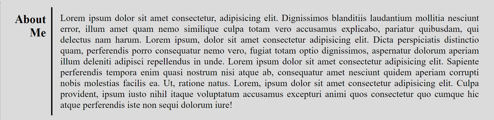
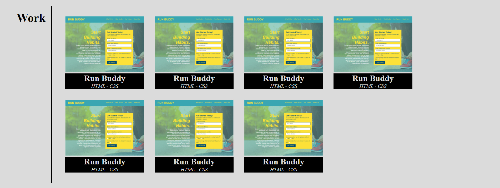
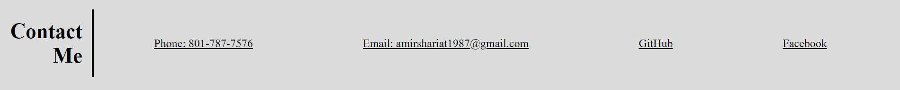

Advanced CSS: Portfolio

## User Story

```
AS AN employer
I WANT to view a potential employee's deployed portfolio of work samples
SO THAT I can review samples of their work and assess whether they're a good candidate for an open position
```

## Acceptance Criteria

```
GIVEN I need to sample a potential employee's previous work
WHEN I load their portfolio
THEN I am presented with the developer's name, a recent photo or avatar, and links to sections about them, their work, and how to contact them
WHEN I click one of the links in the navigation
THEN the UI scrolls to the corresponding section
WHEN I click on the link to the section about their work
THEN the UI scrolls to a section with titled images of the developer's applications
WHEN I am presented with the developer's first application
THEN that application's image should be larger in size than the others
WHEN I click on the images of the applications
THEN I am taken to that deployed application
WHEN I resize the page or view the site on various screens and devices
THEN I am presented with a responsive layout that adapts to my viewport
```

First I created two separate branches for my application, one named "main" branch which is live and the other one is "develop" branch that I used for my coding.

I created my header and hero section as below:


I put a logo of me instead of my name that if you click on it, it will take you back to the home page and also a navigation bar on the right side of header.
Then in hero section I included a qoute I like from Pele and also a picture of me.

After that you see the three sections of my page as below:







and this is the address of my deployed application:
https://ashariat.github.io/